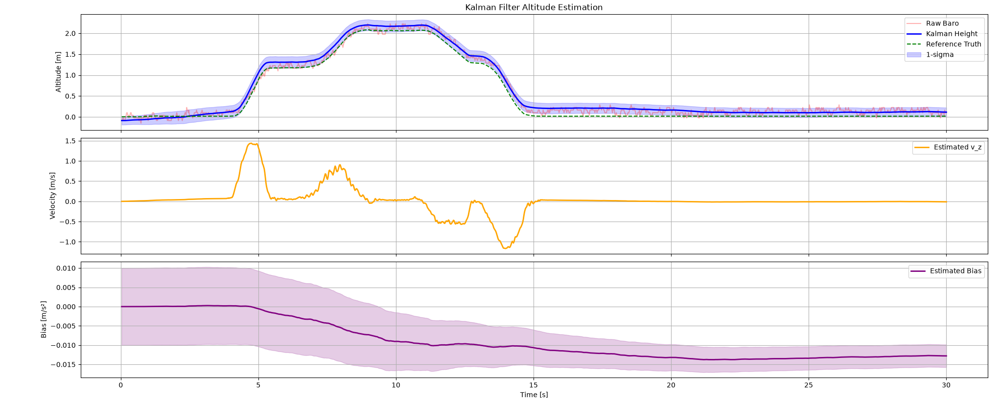

# 2D and 3D Drone Control with PID and Kalman Filtering

I built a **cascaded PID controller** for autonomous waypoint tracking in simulation, ran a **hardware pre-flight safety check** and autonomous trajectory on a real Crazyflie 2.1, and fused barometer + IMU data with a **Kalman filter** for altitude estimation.

**Hardware:** Bitcraze Crazyflie 2.1 Brushless, Crazyradio, Lighthouse positioning system
**Tools:** Python 3.8+, RetroFlight simulation environment, `retro_cflib`, `cflib` (`SyncCrazyflie`, `LogConfig`, `SyncLogger`, `MotionCommander`), NumPy, pandas, Matplotlib

---

## 2D PID Control and Waypoint Tracking

**The Problem**

Wind pushes the drone off course. A simple PID that maps position error straight to thrust forces a trade-off: turn up the gain to fight wind harder, and the path overshoots more. I needed a controller that holds a **5m × 5m square path** under wind without that trade-off, plus a mission layer that autonomously routes the drone to collect batteries around obstacles.

**The Implementation**

I split the controller into two loops instead of one:

- **Outer loop** — turns position error into a target velocity, capped at **±3 m/s** so it doesn't accelerate too hard.
- **Inner loop** — turns the gap between that target velocity and the (filtered) actual velocity into thrust.

```python
target_vel = np.clip(self.Kp * error, -3.0, 3.0)
vel_error  = target_vel - self.vel_filtered
d_term     = self.Kd * vel_error
```

This separates "how fast I respond" from "how hard I fight wind" — a single loop can't do both at once.

Two more details matter:
- **Integral reset** — the integral term zeroes out whenever velocity error crosses zero, so it doesn't carry windup from one waypoint into the next.
- **No derivative kick** — the derivative term comes from actual velocity, not the change in error, so a new setpoint doesn't cause a thrust spike.

For battery collection, the mission script:

1. Pulls the obstacle grid (`get_map()`) and battery positions (`get_batteries()`).
2. Orders battery visits by **greedy nearest-neighbor** — not optimal, but fast enough for a sparse map.
3. Approaches each battery in two steps: fly to an open cell nearby first to slow down and align, then fly into the battery cell to trigger pickup.

**The Performance**

| Requirement | Target |
|---|---|
| Square path tracking | Sub-meter accuracy |
| Batteries collected | At least 3 per run |

The cascaded design was the direct answer to the accuracy requirement under wind — a single-loop PID couldn't hit that target without slowing down waypoint response too.


*Figure 1: The drone navigating the grid map and collecting batteries mid-mission.*

**Limitations & Next Steps**

- **No altitude control** — the z-gain is fixed at zero, so height isn't actively regulated by this PID.
- **Gains are hand-tuned**, not derived from a method like Ziegler–Nichols or gain scheduling.
- **Routing isn't optimal** — nearest-neighbor works for a sparse map, but a real TSP heuristic would save time on a denser one.

---

## Basic Flight Operations and High-Level Mission Planning

**The Problem**

Real hardware doesn't forgive bad state. Arm a drone that's still tilted, drifting, low on battery, or losing signal, and it can crash the second the motors spin up. I needed a pre-flight check that reads live sensor data — not just "is the deck plugged in" — before letting anything fly.

**The Implementation**

The pre-flight check runs five live checks, in order, and stops on the first failure:

| Check | Threshold |
|---|---|
| Lighthouse position variance (`kalman.varPX`) | < 0.01 |
| Roll / pitch | within ±2° |
| Horizontal velocity (vx, vy) | < 0.2 m/s |
| Battery voltage | > 3.7 V |
| Radio RSSI | < 80 |

```python
if var_px >= 0.01:
    print(f"[FAIL] Kalman variance too high: varPX={var_px:.4f} >= 0.01")
    break
```

Checking `kalman.varPX` — not just deck presence — means arming only happens once the position estimate has actually converged. I also had to work around a hard limit: a single `LogConfig` packet caps at **26 bytes**, so non-critical variables (roll, pitch, vx, vy, RSSI) go out as `FP16` (2 bytes) instead of `float` (4 bytes) to fit.

Once armed, `MotionCommander` runs two flights:
1. **Hover** — climb to 0.5 m, hold for 5 seconds, land. Checks basic closed-loop stability.
2. **Rectangle** — climb to 1.0 m, fly a 1m × 1m rectangle, pausing 1 second at each corner so the drone fully stops before turning — otherwise inertia carries it past the corner.

**The Performance**

| Metric | Result |
|---|---|
| Mock test suite (`uav_lab_02`) | 19/19 passed |
| Landing offset from takeoff point | Within 20cm × 20cm |

[Watch the flight demo](flight-ops-mission-planning/uav_preflight_and_trajectory_demo.mp4)

**Limitations & Next Steps**

- **Check runs once** — it doesn't monitor battery, RSSI, or attitude *during* flight, so a mid-mission fault wouldn't trigger an abort.
- **Rectangle uses relative moves** (`forward`, `left`, `back`, `right`), so a small error on one side carries into the next instead of correcting against an absolute reference.

---

## Altitude Estimation with a Kalman Filter

**The Problem**

Neither sensor is good enough alone. The **barometer** gives absolute height but is noisy and drifts. The **accelerometer** responds instantly but drifts without bound once integrated. I needed to fuse both into one estimate that's smooth *and* fast to react — plus a way to log the raw sensor data from real hardware first.

**The Implementation**

Logging runs a Lighthouse check, then streams **baro, 3-axis accel, orientation quaternion, and `stateEstimate.z`** (as ground truth) to CSV at 100 Hz.

The filter does three things:

1. **Rotate + degravitate** — rotate the accelerometer reading from body frame to world frame with the orientation quaternion, then subtract gravity to isolate real vertical motion.

```python
R_rot = quat_to_matrix([qw, qx, qy, qz])
a_z = (R_rot @ np.array([ax_ms2, ay_ms2, az_ms2]))[2] - 9.81
```

2. **Calibrate the offset** — average the barometer's first 2.5 seconds of readings so all later readings are relative to the true start height.
3. **Run the Kalman filter** — state is `[height, vertical velocity, accel bias]`, predicted from acceleration and corrected against the barometer each step.

**The Performance**

| Parameter | Value | Effect |
|---|---|---|
| `acc_std` | 0.05 | Lower = trust IMU more = smoother, more lag |
| `process_noise_acc` | 0.0001 | Controls how fast bias is allowed to drift |
| `baro_std` | 1.25 | Higher = trust barometer less = smoother, more lag |


*Figure 1: Raw barometer (noisy), Kalman-filtered height with 1-sigma band, and Lighthouse ground truth, overlaid.*

**Limitations & Next Steps**

- **Bias is assumed near-constant** — a sudden bias shift (e.g. a knock) gets absorbed slowly, at the rate set by `process_noise_acc`.
- **No outlier rejection** — one bad barometer reading is treated like normal noise. A chi-squared innovation gate would catch it instead.

---

## Files

| File | Description |
|------|-------------|
| `2d-pid-waypoint-tracking/src/retroflight/controller.py` | Cascaded PID controller — computes thrust from state and setpoint |
| `2d-pid-waypoint-tracking/external_control/battery_collection_mission.py` | Waypoint sequencing and nearest-neighbor battery collection |
| `2d-pid-waypoint-tracking/retroflight.png` | Battery collection mission, mid-run |
| `flight-ops-mission-planning/preflight_and_trajectory.py` | Live pre-flight safety check + hover/rectangle trajectory |
| `flight-ops-mission-planning/uav_preflight_and_trajectory_demo.mp4` | Real hardware flight demo |
| `kalman-altitude-estimation/uav_logger.py` | 100 Hz sensor logging (baro, IMU, orientation) |
| `kalman-altitude-estimation/kalman_altitude_filter.py` | Kalman filter fusing barometer + IMU for altitude |
| `kalman-altitude-estimation/kalman_altitude_filter_states_output.png` | Filtered altitude vs. raw baro vs. ground truth |

## Acknowledgments

This project was restructured from coursework completed in the *Advanced UAV Sensor Fusion and Control* module of the M.Sc. Automation programme at Hochschule Darmstadt, under the supervision of Prof. Dr.-Ing. Jan Zwiener, Fachbereich EIT.

The original lab exercises have been refactored with cleaner documentation and reorganised results for portfolio presentation.

